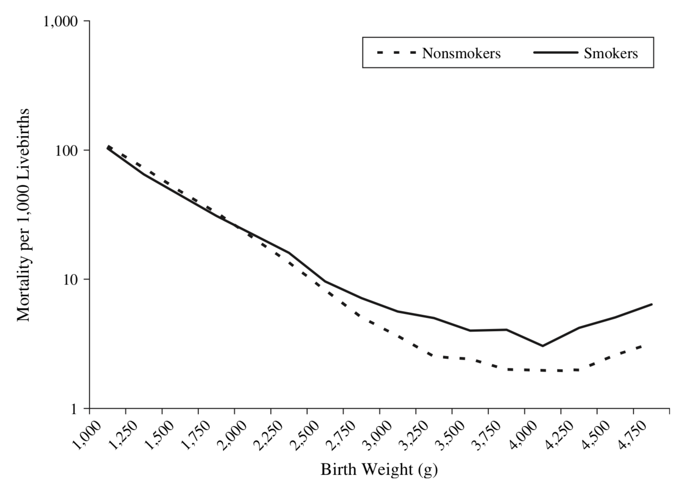
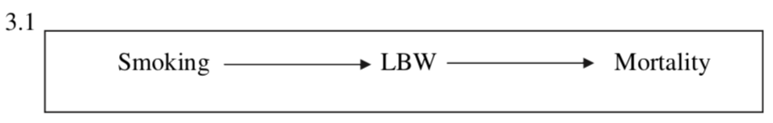
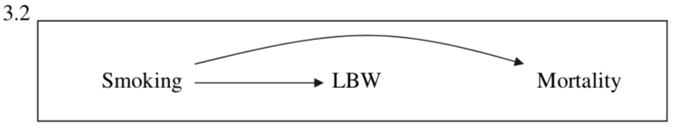
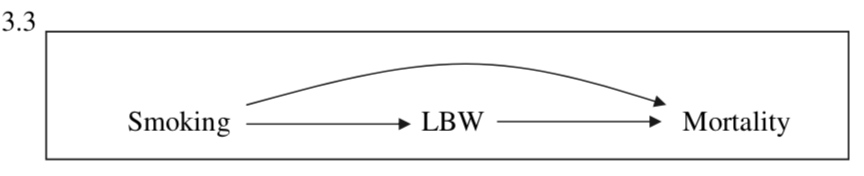
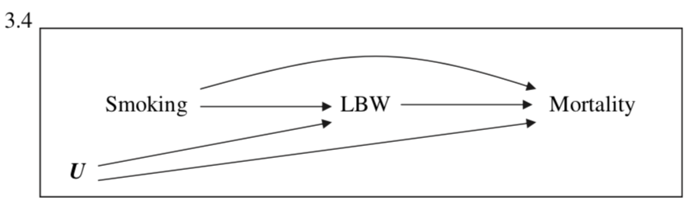
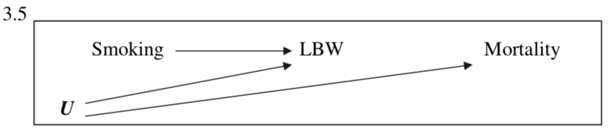
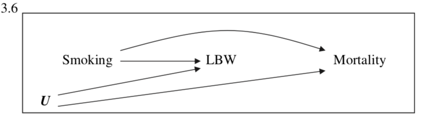
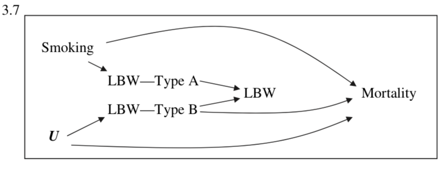

# *Birth Weight Paradox Uncovered?*

When people are looking into prenatal care, someone discovered an interesting phenomenon: when we just focus on babies born with regular weight, mother smoking during pregnancy would increase the infant's mortality rate, which of course makes sense. But if we focus on babies with lower birth weights, mother pregnancy would in turn decrease the infant's mortality rate. 

So here's comes the million-dollar question: 

**Should maternal smoking be encouraged for mothers with premature infants or babies with lower weights?**

&nbsp;

Yes.

&nbsp;

&nbsp;

&nbsp;

**Just Kidding.**

&nbsp;

Ludicrous as it sounds (I mean, we all know smoking is bad), we are put in a bad situation when data do not support our belief. As the plot shows, for babies with a birth weight lower than 2000g, mortality for mother smokers is lower than that of non-smokers.  

So, is it that smoking somehow triggers bodily responses beneficial to babies, or is there something else going on? Hernandez-Diaz et al. explained the paradox in their paper *The Birth Weight "Paradox" Uncovered?*.

## Getting Started (Scenarios 1 and 2)

To investigate why this is the case, researchers proposed a few possibilities why the paradox happened. 

This is the simplest model the researchers proposed. We may think: "Well, maybe smoking causes low weight babies which then causes infant mortality." This chain structure of DAG tells us that mortality and smoking are marginally dependent, but conditionally independent on Low Birth Wright. But our data tell us that mortality and smoking are dependent conditioned on Low Birth Weight. This model is not consistent with our findings.

&nbsp;

Alternatively, we may see the effect of smoking on mortality rate directly. Similarly with Scenario 1, this fork structure of DAG tells us that mortality and smoking are marginally dependent, but conditionally independent on Low Birth Wright. But our data tell us that mortality and smoking are dependent conditioned on Low Birth Weight. This model is not consistent with our findings.

## Got it! (Scenarios 3-5)

This is a combination of Scenarios 1 and 2. This complete causal diagram tells us that smoking and mortality are dependent even if we condition on Low Birth Weight. According to Hernandez-Diaz et al., however, most experts find this scenario overly-simplistic. In this causal diagram, even some common causes were not listed as part of the diagram (which we now know is a bad practice!). Congenital defects or conditions such as preeclampsia would contribute to both lower birth weights and infant mortality rates. 

So what if we do include an unknown factor, let's say, U?

&nbsp;

In a more realistic diagram, which is Scenario 4, an unknown (and often unmeasured) variable comes into play. With some foundational knowledge of forks and chains, we know that if we condition on Low Birth Weight, a second path opens up:

$$\text{Smoking} \rightarrow \text{LBW} \leftarrow \text{U} \rightarrow \text{Mortality}$$

This is a path that gets in the way of understanding the causal relationship between smoking and mortality. Over here, the Paradox seems to reveal itself.

&nbsp;

We isolate the path that causes us the problem to a new diagram: Scenario 5.

When we condition on Low Birth Weight, smoking and U are dependent. Here, we observe that both smoking and U contribute to Low Birth Weight, but U additionally contributes to mortality!

In the group with lower birth weight babies, while smokers may not have a high rate of U, non-smokers would necessarily have to have U to be in that group!

$$\frac{\text{smokers} \Leftarrow \text{not a high rate of U}}{\text{non-smokers} \Leftarrow \text{Necessarily had U!}}$$

Now we know this is an unfair comparison when we only draw inferences between smoking and infant mortality. Correlation doesn't imply causation!

## Getting fancy (Scenarios 6 and 7)

## Paradox unveiled

### What do we learn?

### References

Hernández-Díaz, S., Schisterman, E. F., & Hernán, M. A. (2006). The birth weight “paradox” uncovered?. American journal of epidemiology, 164(11), 1115-1120.
