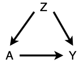
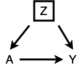
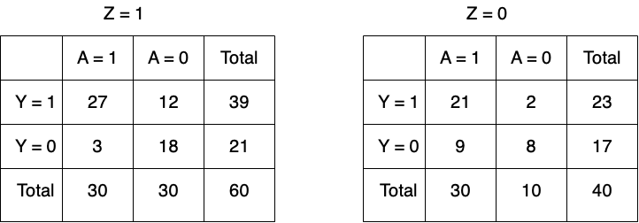
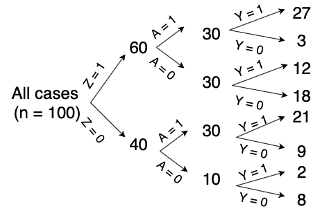
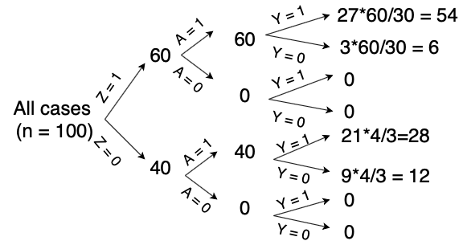
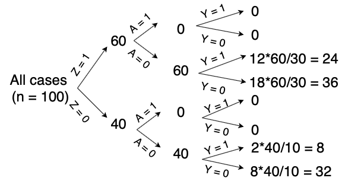

# *Inverse Probability Weighting*

What is inverse probability weighting? It sounds like one of many fancy terms in Causal Inference. It is. But I like to think of it as essentially building a fair playground. Why is that? Hear me out.

Consider the following causal diagram (simplified, of course).

We want to know more about the causal relationship between A and Y. What should we do?

From the idea of **d-separation**, we know there are two open paths between A and Y:

+ $A \rightarrow Y$

+ $A \leftarrow Z \rightarrow Y$

Since we are only interested in knowing the first open path, a natural approach would be to condition on Z.

In "causal" terms, if treatment A and outcome Y are d-separated given Z under the null hypothesis, then there are no open paths generating unwanted confounding. Then we say that the outcomes of the treated and untreated are comparable, in the sense that we can directly compare the outcome under when $A = 0$ and $A = 1$.

But if the numbers of people treated and untreated are different, we cannot make a quite fair comparison (hense a fair playground). Here enters an idea called *inverse probability weighting*.

## A Nice Tree

Consider the following data:

We are motivated to understand the effect of A on Y. How might we approach?

&nbsp;

If any, we could obtain a tree diagram from the given data.

With that, we have the freedom to make the treated and untreated have the same number of people through **upscaling**.

If $A = 1$, the tree becomes:

If $A = 0$, the tree becomes:

&nbsp;

Let's break this down. Take the upper branch of the $A = 0$ scenario as an example. In this scenario, we pretend that no one was treated, with the hope to learn how the outcome changes. Therefore, under the $Z = 1$ branch, the $A = 1$ group doesn't exist anymore. Reasonably, we can upscale the $A = 1$ group ($n = 30$) to the size of the sample space ($n = 60$) by $\frac{60}{30}$. This fraction $\frac{60}{30}$ is called the **weight**.

+ $\frac{30}{60}$ is $P(A = 0 \mid Z)$, and this weight is the inverse of $P(A = 0 \mid Z)$. Hence the name inverse probability weighting (IP weighting).

&nbsp;

Now we can count the outcome given $A = 1$ and $A = 0$. 

+ In the $A = 1$ tree diagram, $P(Y = 1) = (54 + 28)/100 = 0.82$.
  - This probability is called $P(Y = 1 \mid \text{do}(A = 1))$.
  
\vspace{5mm}

+ In the $A = 0$ tree diagram, $P(Y = 1) = (24 + 8)/100 = 0.32$.
  - This probability is called $P(Y = 1 \mid \text{do}(A = 0))$.

## Do-Probability and Causal Effect

This may be different from what you know about conditional probability, but first convince yourself that $P(Y = 1 \mid \text{do}(A = 1)) \neq P(Y = 1 \mid A = 1)$.

From the initial tree diagram, we can count that $(Y = 1 \mid A = 1) = \frac{27 + 21}{30 + 30} = 0.8 \neq 0.82$. 

Why is this the case?

&nbsp;

It turns out that this is related to one notion of causation: **intervention**.

+ $P(Y = 1 \mid A = 1)$ is an observational probability (i.e. What do we observe given $A = 1$?)

\vspace{5mm}

+ $P(Y = 1 \mid \text{do}(A = 1))$ is an intervention probability. Intervening on A is the same as removing all arrows into A.
  - This makes intuitive sense. What we did in the last section was that we set A to a certain value no matter what factors actually influence A. In other words, we **intervene** or force how A behaves.

&nbsp;

Finally, we are ready to define the causal effect of A on Y:

$$\text{ACE (Average Causal Effect)} = P(Y = 1 \mid \text{do}(A = 1)) - P(Y = 1 \mid \text{do}(A = 0))$$

If $\text{ACE} = 0.5$:

+ We interpret it as the probability of $Y = 1$ is $50\%$ higher if we have everyone treated, compared with if we have no one treated.

&nbsp;

Hope this helps your understanding of some more basic causal inference! Stay tuned for the next post.

## References

Myint, Leslie. (2020). *STAT 394: Causal Inference*. Retrieved April. 7th, 2020. https://lmyint.github.io/causal_spring_2020/references.html

