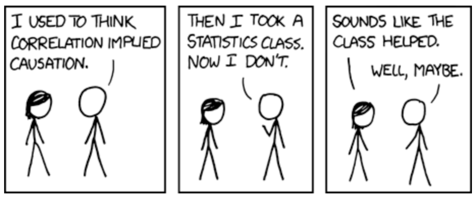

  
# Preface {-}

Hello! Welcome to the bookdown of my STAT 394 Causal Inference Portfolio! 

Contact me if you have any questions. (zuofuhuang@gmail.com)

Since we are talking about Causal Inference, of course we need the aid of some old-fashioned comic.

Credit: https://xkcd.com/552/

